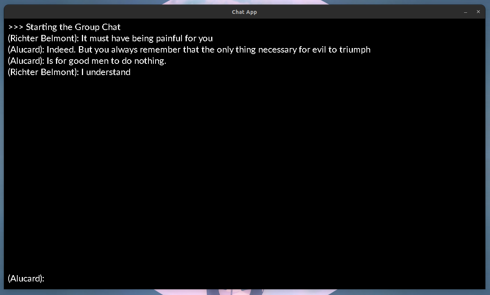

# server-client
Basic server to N clients in C sockets. 

Its a simple group chat, where a server receives messages from one client and send it to all connected clients:



Right now it only works on a internal network (can communicate over your devices connected through wi-fi or cables).

## Usage

Compile both files:
```sh
gcc -o server server.c
gcc -o client client.c
```

Run the server:
```sh
./server
```

Run N clients:
```sh
./client client 192.168.1.1 8000 # <client> <ip> <port> 
```
